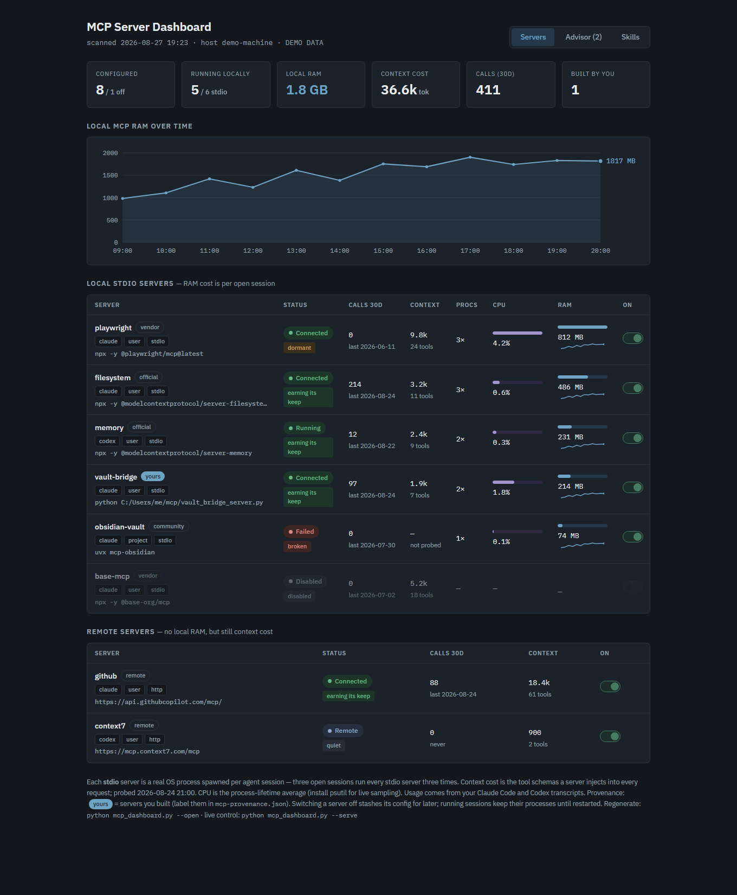

# MCP Dashboard

[](https://github.com/SarutobiSasuke8/mcp-dashboard/actions/workflows/tests.yml)
[](LICENSE)

Cost and benefit of your MCP toolbox, across **Claude Code, OpenAI Codex,
Gemini CLI, and Cursor** — what each server costs in RAM, CPU, context
tokens, and startup time, weighed against how often you actually call it,
with working on/off switches and a skills directory.

**Zero dependencies.** Python 3.10+ standard library only; `psutil` is an
optional extra for live CPU sampling. Clone and run.



Design record: [DESIGN.md](DESIGN.md) — why, how it measures cost, the
provenance and verdict rules, and how the control endpoint is secured.
What's next: [ROADMAP.md](ROADMAP.md).

**Where outputs go:** when the tool sits inside an Obsidian vault (one
containing an `Obsidian Vault Management/` folder), markdown outputs go to
that vault's `Systems/` folder; run standalone, they go to `output/` next to
the script instead. Point it anywhere with `MCP_DASHBOARD_VAULT` or the
`--html` / `--note` flags.

## Why

Local **stdio** MCP servers (launched via `npx`, `node`, `uvx`, `python`,
`docker`) are real OS processes, spawned **once per open agent session** —
three open sessions run every stdio server three times. Remote connectors
cost no local RAM but still inject tool schemas into every request. So the
question is never RAM alone: it is cost versus use.

## Quickstart

```
git clone https://github.com/SarutobiSasuke8/mcp-dashboard.git
cd mcp-dashboard
python mcp_dashboard.py --probe --open     # first run: fills in context cost
python mcp_dashboard.py --serve            # then act on the Advisor tab
```

## Usage

```
python mcp_dashboard.py                 # scan, write dashboard + directory note
python mcp_dashboard.py --open          # ...and open it in a browser
python mcp_dashboard.py --serve         # LIVE at 127.0.0.1:7817, toggles work
python mcp_dashboard.py --probe         # also measure context cost + startup
python mcp_dashboard.py --report        # append a snapshot to the vault report
python mcp_dashboard.py --tasks         # file high-severity findings as tasks
python mcp_dashboard.py --profile coding    # apply a named server set
python mcp_dashboard.py --list-profiles
python mcp_dashboard.py --json out.json # machine-readable snapshot (env redacted)
python mcp_dashboard.py --no-cli        # skip `claude mcp list` (faster)
python mcp_dashboard.py --demo          # sample data, to preview the visual
```

Tests: `python -m unittest discover -s tests` (standard library only).

Windows: use `py mcp_dashboard.py ...` if `python` isn't on your PATH.
Optional: `pip install psutil` for live CPU sampling (and any CPU reading at
all on Windows).

**Platforms:** built and battle-tested on Windows; the macOS/Linux paths
(`ps`-based process matching, POSIX config locations) are implemented and
unit-tested in CI but have had less real-machine mileage — issues welcome.

## Views

- **Servers** — tiles, RAM-over-time chart, and a table per server: status,
  verdict, calls in 30 days, context cost, process count, CPU, RAM with
  sparkline, and an on/off switch. Local stdio and remote servers are listed
  separately because only the former cost RAM.
- **Advisor** — ranked recommendations with estimated savings and one-click
  switch-off, profile buttons, most-used and heaviest bar charts, and any
  plaintext credentials found in config.
- **Skills** — every skill from the vault, project, user, synced, and plugin
  paths, with 30-day usage, `locked` markers from `skills-lock.json`, and
  name-collision warnings showing which copy wins.

## How it measures

- **Config**: `~/.claude.json` (user + per-project), each project's
  `.mcp.json`, `~/.codex/config.toml` (`CODEX_HOME` respected),
  `~/.gemini/settings.json`, `~/.cursor/mcp.json`.
- **RAM/CPU**: process table via psutil, else `ps` / PowerShell
  `Get-CimInstance`; matches each server's most distinctive command token and
  sums the process tree. Shells, editors, and search tools are never counted,
  and neither are this script's own ancestors.
- **Context cost** (`--probe`): starts each stdio server, completes the MCP
  `initialize` handshake, calls `tools/list`, and records tool count,
  estimated schema tokens, startup latency, and real stderr on failure.
  Cached in `mcp-probe-cache.json`.
- **Usage**: `tool_use` blocks named `mcp__<server>__<tool>` in Claude Code
  transcripts (`~/.claude/projects/**/*.jsonl`), plus best-effort parsing of
  Codex rollout logs. Skill invocations are counted the same way.

## Verdicts

`earning` (used in 30d) · `quiet` (cheap and idle) · `dormant` (used before,
not lately) · `unused` (never called, still costing) · `expensive` (high cost,
≤2 calls) · `broken` (failing) · `disabled`. Servers installed less than 7
days ago are not judged as unused.

## Provenance

Badges: `yours` (self-built), `official`, `vendor`, `community`, `remote`,
`unlabeled`. Auto-detected, overridden by `mcp-provenance.json`:

```json
{ "vault-bridge": "self-built",
  "some-server": { "provenance": "community", "note": "forked for X" } }
```

## Toggles and profiles (`--serve`)

The static HTML cannot change config — control lives in the local server.
Off removes the server from that agent's config (CLI first, direct file edit
with a timestamped backup as fallback) and stashes it in
`mcp-disabled.json`; on restores it. Profiles in `mcp-profiles.json` enable
a named set and disable everything else, across all agents at once. Changes
apply to **new** sessions.

Because this endpoint edits real config, it is defended three ways: it binds
to loopback only, it rejects requests whose `Host` is not loopback (blocking
DNS rebinding), and every request carries a per-run token — in the query
string for the page, in an `X-MCP-Token` header for anything that mutates,
which a cross-origin page cannot send without a CORS preflight this server
never grants. Open the URL the command prints; the token is in it.

## Scheduling

```powershell
.\Register-MCPDashboardScan.ps1                              # every 4h, quiet scan
.\Register-MCPDashboardScan.ps1 -IntervalHours 12 -Report -Probe
.\Register-MCPDashboardScan.ps1 -Unregister
```

## Files

| File | What |
| --- | --- |
| `mcp_dashboard.py`, `mcpdash/` | The tool |
| `mcp-provenance.json` | Your provenance labels (committed) |
| `mcp-profiles.json` | Your named server sets (committed) |
| `Register-MCPDashboardScan.ps1` | Scheduled-task registration |
| `tests/` | Test suite (`python -m unittest discover -s tests`) |
| `<outputs>/MCP Server Dashboard.html` | Generated dashboard |
| `<outputs>/MCP Directory.md` | Living registry note |
| `<outputs>/MCP Usage Report.md` | Rolling snapshots (`--report`) |
| `mcp-registry.json`, `mcp-history.jsonl`, `mcp-probe-cache.json`, `mcp-usage-cache.json`, `mcp-disabled.json` | Machine-local state (gitignored) |

## Trimming RAM

1. Act on the Advisor tab — it ranks by what you actually use.
2. Move single-project servers to that project's `.mcp.json`.
3. Prefer remote (HTTP) variants where they exist — zero local RAM.
4. Close idle sessions; each holds its own copy of every stdio server.

## Safety

Every config edit — including ones routed through the `claude`/`codex`
CLIs — takes a timestamped backup of the file first, and disabled servers
are stashed in full so switching them back on is lossless. The test suite
runs inside a hard sandbox (`Path.home` patched, agent CLIs stubbed) and
can never touch your real config.

## License

[MIT](LICENSE). Free to use, fork, and build on.
